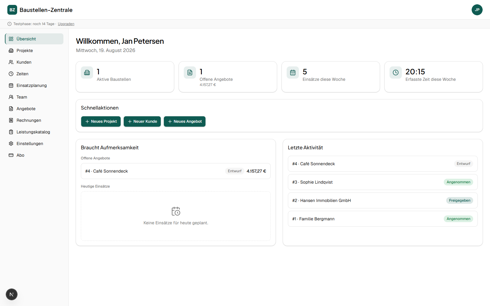
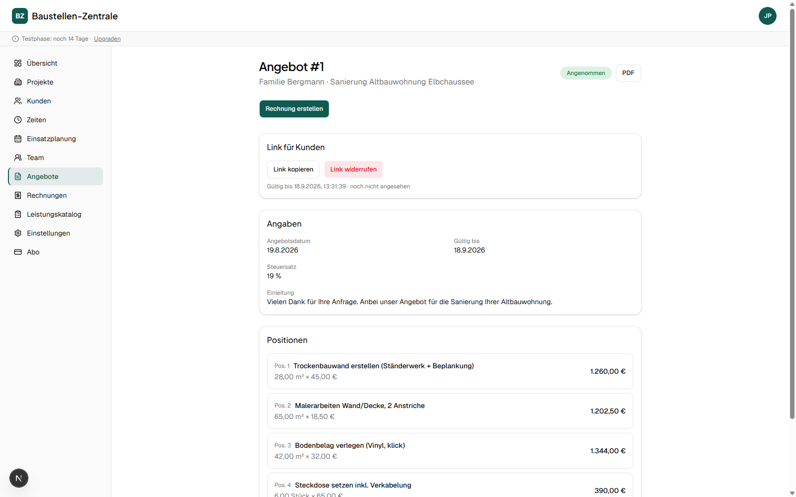
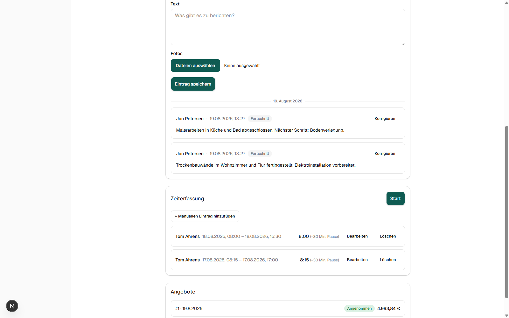
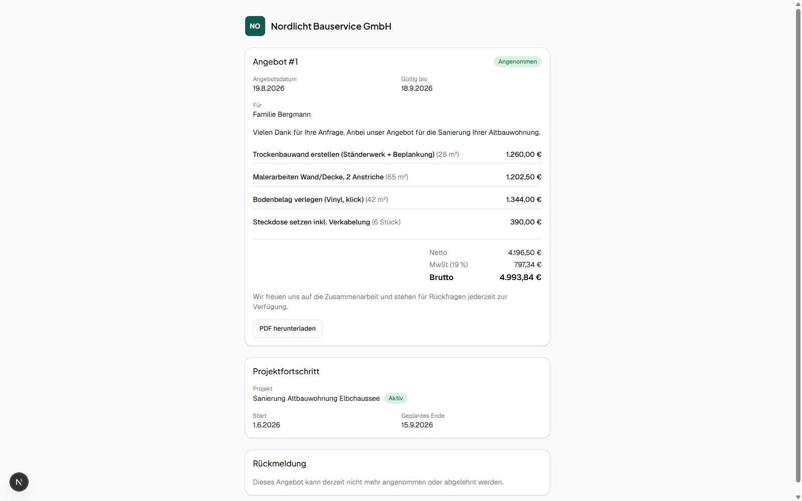
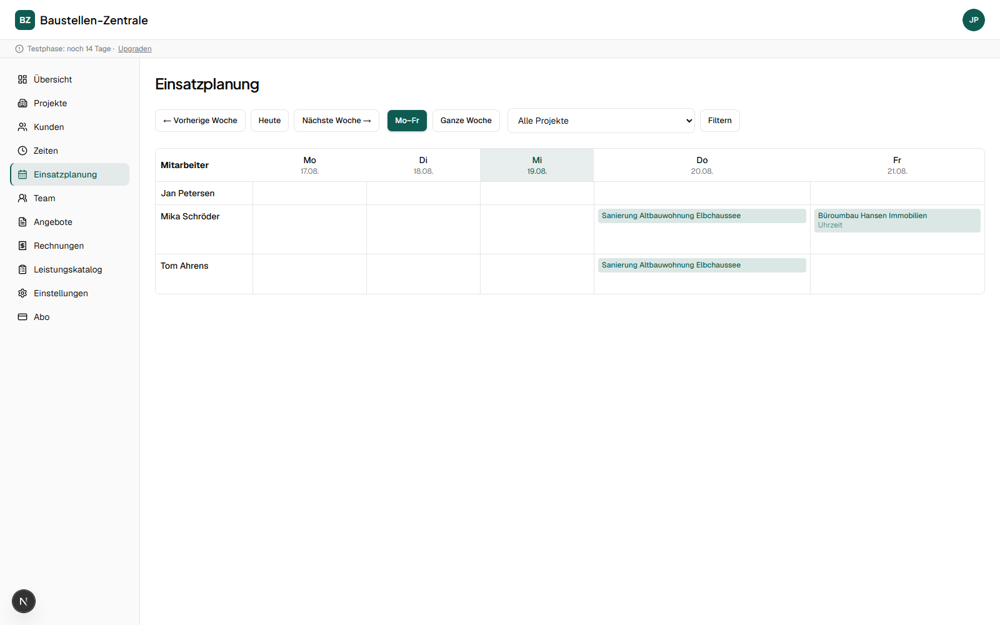
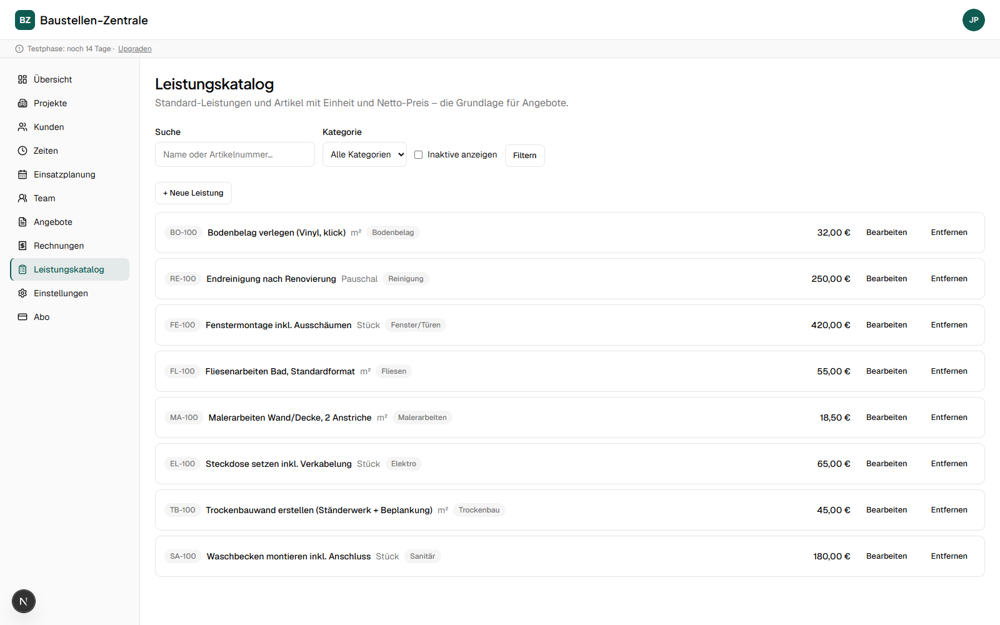
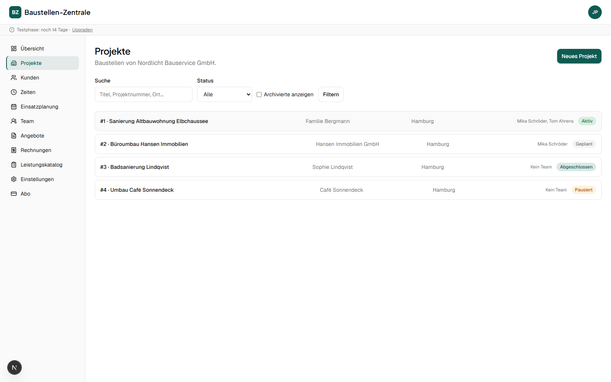
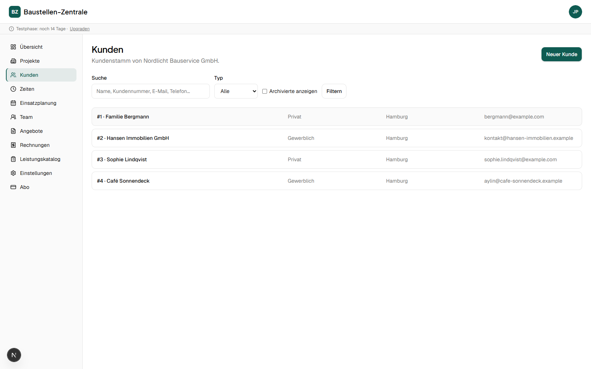
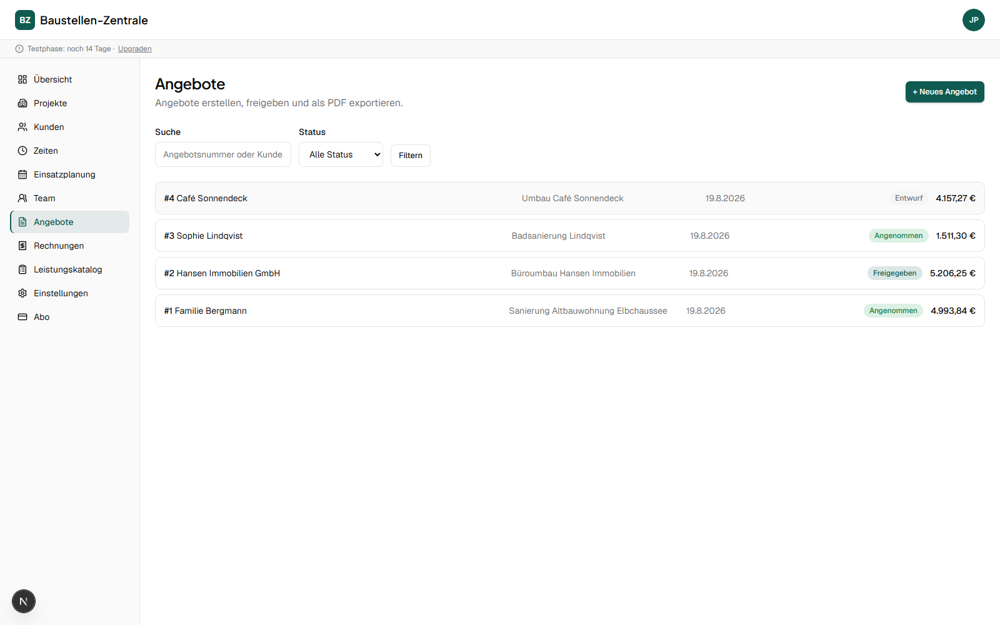
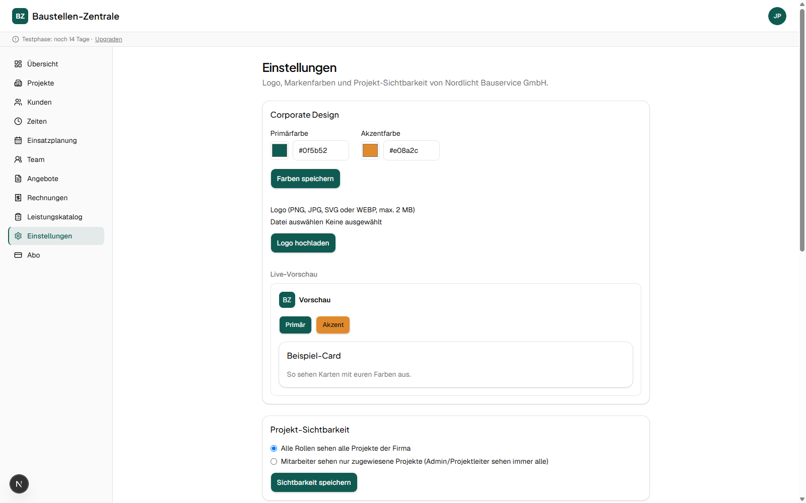

# Baustellen-Zentrale

Mandantenfähige SaaS-Webapp für Handwerks- und Baubetriebe — von der ersten Kundenanfrage über Angebot, Auftrag und Baustellendokumentation bis zur Rechnung. Gebaut als Portfolio-/Lernprojekt, architektonisch aber wie ein echtes Produkt: strikte Mandantentrennung auf Datenbankebene, geld- und rechtssichere Datenmodellierung, Anbindung an Drittsysteme (Buchhaltung, E-Mail-Versand, Zahlungsabwicklung).

> ⚠️ **Portfolio-Projekt.** Kein Live-Betrieb mit echten Kunden. Die Screenshots unten zeigen die App mit frei erfundenen Demo-Daten (Firma, Kunden, Projekte).

## Screenshots

| | |
|---|---|
|  **Dashboard** — rollenabhängige Startseite: Kennzahlen, „Braucht Aufmerksamkeit", letzte Aktivität |  **Angebot** — Positionen, Summen, Kunden-Link-Verwaltung, direkter Weg zur Rechnung |
|  **Baustellen-Tagebuch** — unveränderliches, hash-verkettetes Protokoll (siehe [Architektur](#architektur--sicherheits-highlights)) |  **Kundenportal** — öffentlicher, Token-basierter Link ohne Login, im Branding des Betriebs |
|  **Einsatzplanung** — Wochenraster, Doppelbelegungen sichtbar |  **Leistungskatalog** — Preisgrundlage für Angebote, cent-genau |

<details>
<summary>Weitere Screenshots (Projekte, Kunden, Angebote, Einstellungen)</summary>






</details>

## Was die App kann

**Kernverwaltung**
- Mandantenfähiges CRM (Kunden, privat/gewerblich), generisches „Projekt"-Objekt mit Branchenmodul-Feldern
- Rollen `admin` / `projektleiter` / `mitarbeiter` mit unterschiedlichen Rechten, firmenweite Sichtbarkeits-Einstellungen
- Corporate Design pro Firma (Logo, Markenfarben) — zieht sich bis ins Kundenportal und die E-Mails durch

**Baustellen-Dokumentation**
- Bautagebuch: **append-only mit Hash-Kette pro Projekt** — Einträge (inkl. Fotos) sind nachträglich weder änder- noch löschbar, Korrekturen sind neue, verknüpfte Einträge; ein Verifizierungs-Button prüft die Kette
- Projektbezogene Zeiterfassung (Timer + manuell) und Einsatzplanung mit Konfliktsichtbarkeit

**Angebote → Aufträge → Rechnungen**
- Angebote mit Leistungskatalog-Positionen, Freigabe-Workflow, PDF-Export
- Optionaler KI-gestützter Angebotsentwurf aus einer formlosen Vor-Ort-Beschreibung (Anthropic Claude) — Mensch prüft und gibt frei, die KI erzeugt nie verbindliche Preise ohne Katalogbezug
- **Öffentliches Kundenportal**: Betrieb teilt einen kryptographisch zufälligen Link; Kunde sieht Angebot + gefilterten Projektfortschritt ohne Login, nimmt an oder lehnt ab — rechtlich nachvollziehbar protokolliert (Name, Zeitpunkt, IP)
- Rechnungsstellung über **sevdesk** (die App erzeugt bewusst keine eigenen Rechnungsnummern/-PDFs — das bleibt beim GoBD-zertifizierten Fachsystem), inkl. verschlüsselter Zugangsdaten pro Firma
- Angebotsversand per E-Mail (**Brevo**) mit Zustellprotokoll

**Abrechnung**
- Stripe-Abos (Trial → Basic/Pro), Feature-Gating rein serverseitig durchgesetzt

## Architektur- & Sicherheits-Highlights

Der Teil, der bei einem Portfolio-Projekt normalerweise fehlt — hier bewusst mit Sorgfalt gebaut:

- **Mandantentrennung nie nur im App-Code.** Jede Tabelle mit Firmenbezug erzwingt Row-Level-Security in Postgres; eine `SECURITY DEFINER`-Funktion (`current_company_id()`) liefert die Firma des Aufrufers, ohne rekursive Policies zu benötigen.
- **Additive Grants als wiederkehrende Lektion.** Postgres-Spalten- und Tabellen-Grants sind additiv, kein Override — ein vom Projekt-Setup ererbter Tabellen-Grant kann eine spätere Spalten-`REVOKE` unwirksam machen. Dieses Muster wurde einmal live entdeckt (unautorisiertes Schreiben eines Billing-Felds trotz vermeintlicher Sperre) und danach durchgängig proaktiv angewendet: kritische Tabellen entziehen zunächst den ganzen Tabellen-Grant und vergeben Spalten gezielt neu.
- **Geld ausschließlich als Ganzzahl-Cent**, nie als Float — Positionssummen, MwSt. und Rundung laufen über exakte Integer-/BigInt-Arithmetik im Code, nie in der Datenbank und nie durch die KI.
- **Third-Party-Secrets verschlüsselt at-rest** (AES-256-GCM), nie im Klartext an den Client — selbst der eigene Admin sieht nur einen Verbindungsstatus, nie den Schlüssel. Kontrollierter Lesezugriff ausschließlich über eine schmale `SECURITY DEFINER`-Funktion für den serverseitigen API-Aufruf.
- **Öffentliche Flächen ohne privilegierten Client-Zugriff.** Das Kundenportal (`/angebot/<token>`) läuft vollständig serverseitig; anonyme Besucher bekommen Daten ausschließlich über eng zugeschnittene `SECURITY DEFINER`-Funktionen, die nie interne IDs preisgeben und bei ungültigem/abgelaufenem/widerrufenem Token einheitlich (nicht unterscheidbar) ablehnen.
- **Mehrschichtige Idempotenz** bei Vorgängen mit Außenwirkung (Rechnung aus Angebot, Kundenannahme): DB-Unique-Constraint als letztes Netz, vorherige Prüfung gegen das Drittsystem, gesperrter Button auf Client-Seite — verhindert doppelte Rechnungen/Antworten auch bei Netzwerk-Timeouts oder Doppelklicks.
- **sevdesk-Fehlerdiagnose statt Rätselraten.** Ein älterer sevdesk-Endpunkt versteht verschachteltes JSON nicht zuverlässig und legt Datensätze scheinbar erfolgreich, aber inhaltlich leer an — durch systematisches Nachvollziehen der Antwort-Payload gefunden und auf klassische Bracket-Formkodierung umgestellt.
- Vollständige Testabdeckung der sicherheitskritischen Pfade: Vitest-Unit-Tests für Geld-/Rundungslogik, Verschlüsselung und Provider-Idempotenz; Vitest-Integrationstests gegen die echte Supabase-Instanz für Cross-Tenant-Isolation, Rollen-Sperren und Grant-Korrektheit (100+ Tests).

## Tech-Stack

- **Frontend/Backend:** Next.js (App Router) · TypeScript strict · React
- **Datenbank/Auth:** Supabase (Postgres, Auth, Storage, Row-Level Security), EU-Region
- **UI:** Tailwind CSS · shadcn/ui (Theming über CSS-Variablen) · Framer Motion
- **KI:** Anthropic Claude API (serverseitig)
- **Zahlungen:** Stripe (Subscriptions)
- **Buchhaltung:** sevdesk-API
- **E-Mail:** Brevo (Transactional Email API)
- **Hosting:** Vercel (Region `fra1`)

## Wie das entstanden ist

Dieses Projekt ist im gepairten Arbeiten mit Claude Code entstanden — Meilenstein für Meilenstein, mit Spezifikation, Architekturentscheidung und Code-Review durch mich. Für sicherheitskritische Schritte (Mandantentrennung, Zahlungslogik, Secret-Handling, öffentliche Endpunkte) gab es jeweils einen bewussten Review-Checkpoint, bevor es weiterging — sichtbar an den oben beschriebenen, tatsächlich gefundenen und behobenen Bugs. Den Umgang mit KI-gestützten Werkzeugen sehe ich heute als Teil professioneller Softwareentwicklung, nicht als Abkürzung um sie herum: Ich habe jede Architekturentscheidung verstanden und verantwortet, nicht nur abgenickt.

## Lokal starten

```bash
npm install
npm run dev
```

Die App läuft anschließend unter [http://localhost:3000](http://localhost:3000).

### Umgebungsvariablen

```bash
cp .env.local.example .env.local
```

Danach die Werte aus dem eigenen Supabase-Projekt eintragen (Project Settings → API). Für die volle Funktionalität (KI-Entwurf, Stripe, sevdesk, Brevo) werden weitere Secrets benötigt — siehe die Kommentare in `.env.local.example`. `.env.local` ist gitignored und darf nie committet werden.

| Variable | Beschreibung |
| --- | --- |
| `NEXT_PUBLIC_SUPABASE_URL` | URL des Supabase-Projekts |
| `NEXT_PUBLIC_SUPABASE_ANON_KEY` | Öffentlicher Anon-Key des Supabase-Projekts |

### Datenbank

Alle Schemaänderungen liegen als versionierte SQL-Migrationen unter [`supabase/migrations/`](supabase/migrations/) — Anwendung und Reihenfolge sind in [`supabase/README.md`](supabase/README.md) dokumentiert.

### Build & Tests

```bash
npm run build
npm run lint
npm run typecheck
npm run test
```

## Ordnerstruktur

```
src/
  app/            Next.js-Routen
    (app)/        authentifizierter Bereich (eigenes Layout mit Navigation)
    angebot/      öffentliches Kundenportal (kein Auth, eigenes minimales Layout)
    api/          Webhooks (Stripe)
  core/           branchenagnostische Bausteine (Auth, Tenancy, CRM, Geld, Krypto, E-Mail, Rechnungs-Provider …)
  modules/handwerk/  branchenspezifische Logik für Handwerks-/Baubetriebe
supabase/
  migrations/     versionierte SQL-Migrationen (RLS, Trigger, SECURITY DEFINER-Funktionen)
tests/
  unit/           Vitest — Geld-/Rundungslogik, Verschlüsselung, Provider
  integration/    Vitest gegen echte Supabase-Instanz — RLS, Rollen, Cross-Tenant
```

Ausführlicher Projektkontext in [`docs/Projektkontext.md`](docs/Projektkontext.md), Meilenstein-Fahrplan in [`docs/Implementierungsplan_MVP.md`](docs/Implementierungsplan_MVP.md).
